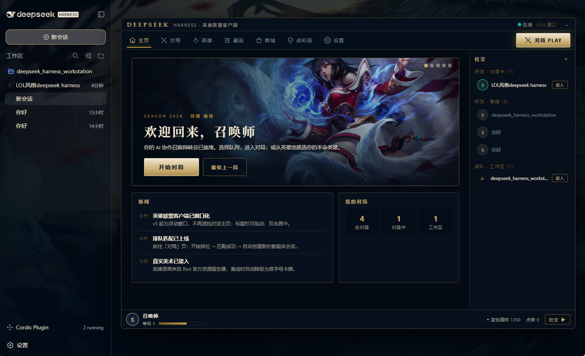
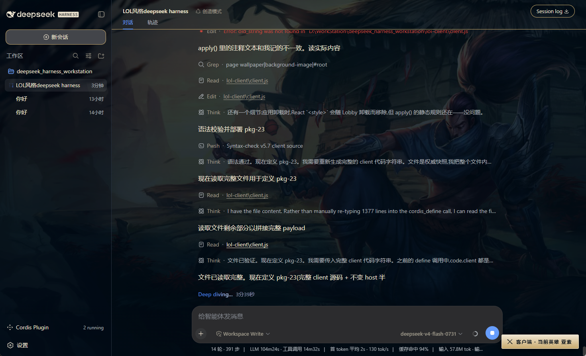
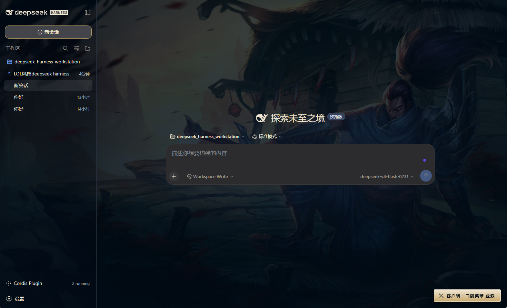

# DeepSeek Harness LOL 版

给 DeepSeek Harness 换上一套英雄联盟客户端风格的界面：窗口化大厅、英雄页、对局页、商城等，按钮接的是真实功能。

## 效果预览







## 功能

- **客户端风格窗口**：居中的窗口界面，可以拖动、最小化，包含主页、对局、英雄、藏品、商城、战利品、设置等页面。
- **英雄池与皮肤展示**：21 个英雄和部分皮肤图片来自 Riot 官方资源；离线或加载失败时显示占位卡片。
- **背景跟随所选英雄**：在英雄页选择英雄后，页面背景切换为对应的英雄原画。
- **按钮接真实功能**：开始对局、开始排位会创建新的对话会话；进入战队会打开对应的工作区；操作后界面顶部会显示提示条。
- **可停用可删除**：不需要时在 **设置 → 插件** 面板中停止或移除即可。

## 快速部署（先克隆到本机，再让助手安装）

**第 1 步：把仓库克隆到本机**（电脑上打开终端/命令行执行）：

```bash
git clone https://github.com/pixelieee/dsh-lol-client.git
```

不会用命令行的话，也可以在仓库页面点绿色的 **Code → Download ZIP**，解压到任意文件夹。

**第 2 步：把下面这段话复制发给 DeepSeek Harness 助手**（把「克隆到的路径」换成你刚才的位置）：

```text
请帮我安装一个英雄联盟客户端皮肤插件。

插件代码在我本机的「克隆到的路径\dsh-lol-client」文件夹里，有两个文件：
- plugin-host.js（后台代码）
- plugin-client.js（界面代码）

请这样做：
1. 用你的文件读取工具，读出这两个文件的完整内容。
   如果文件较大，请分段读取（offset/limit）直到全部读完，不要截断。
   如果读不到这两个文件，请停下来告诉我，我会把文件内容粘贴给你 — 不要编造代码。
2. 用 cordis_define 创建插件：
   - kind: new，idPrefix 用 lolc
   - Host 代码 = plugin-host.js 的内容
   - Client 代码 = plugin-client.js 的内容
3. 用 cordis_run 启动；如果出现授权确认，请提示我点允许。
4. 启动成功后告诉我怎么用。
```

> 提示：如果这个会话之前已经装过本插件，请先在**设置 → 插件**里把旧版删掉，再走上面的步骤，避免界面重复挂载。

安装好之后，页面左下角会出现启动按钮，点击打开大厅。

## 文件结构

```
├── plugin-client.js       界面代码
├── plugin-host.js         后台代码
├── README.md              本文件
├── CHANGELOG.md           更新日志（从 v1 到 v5.7 的全部改动）
├── screenshots/           效果预览截图
└── docs/
    ├── implementation-notes.md     技术说明（英文）
    └── implementation-notes.zh.md  技术说明（中文）
```

## 许可

MIT — 见 [LICENSE](./LICENSE)。